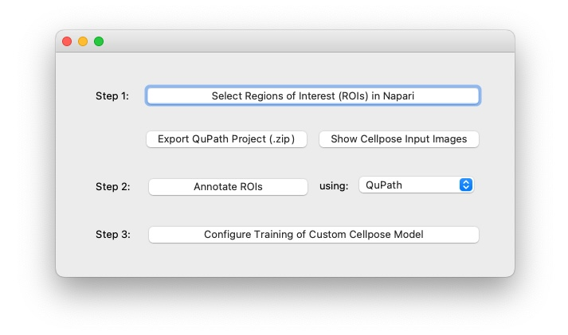
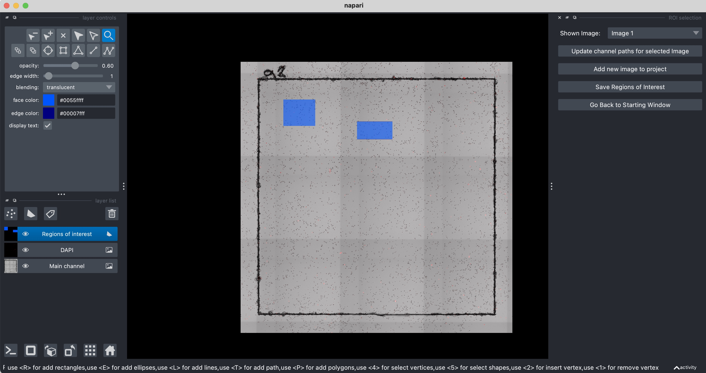
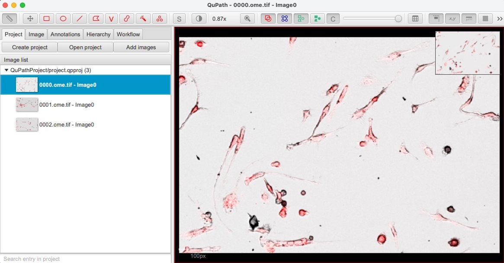
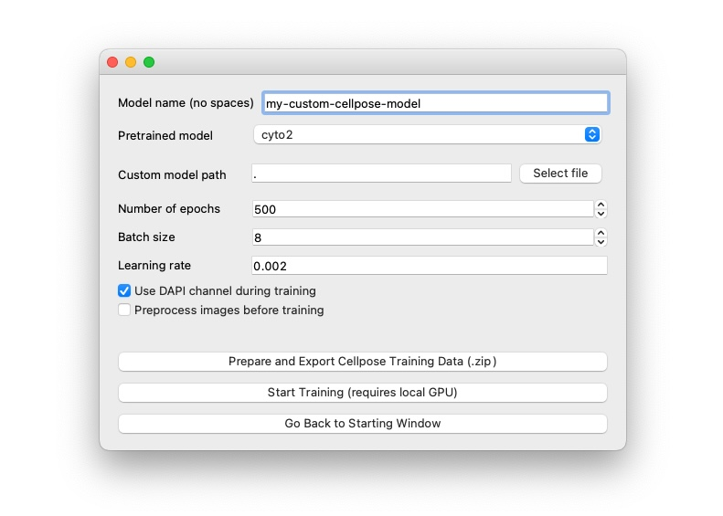

# Tool for Image Annotation and Training Cellpose
Graphical tool for quickly creating image segmentation annotations and training custom [Cellpose](https://www.cellpose.org) models.

Main features:
1. Select regions of interests using Napari (from one or multiple images)
2. Create cell annotations using QuPath or Napari 
3. Train a new Cellpose model (with option to use a remote server with GPU and CUDA support) or export the training data and train a new model using the `cellpose>=2.0` interface.

To install it, see the [documentation](https://abailoni.github.io/cellpose-training-gui). 

## Features
### Select regions of interests in Napari
Load one or more images (with one or multiple channels) and select the areas that you want to annotate and use for training.

### Create annotations in QuPath or Napari
Get a QuPath project that you can directly use to annotate the regions you selected, or annotate them directly using Napari.

### Train custom cellpose models
Train a new model directly from the tool, or export the training data and train a new model using the `cellpose>=2.0` interface.

#### Train custom model on a remote server
If your machine does not have a GPU and CUDA support, you can install the `traincellpose-server-daemon` on a remote server with a GPU and train your models remotely via the browser. 
